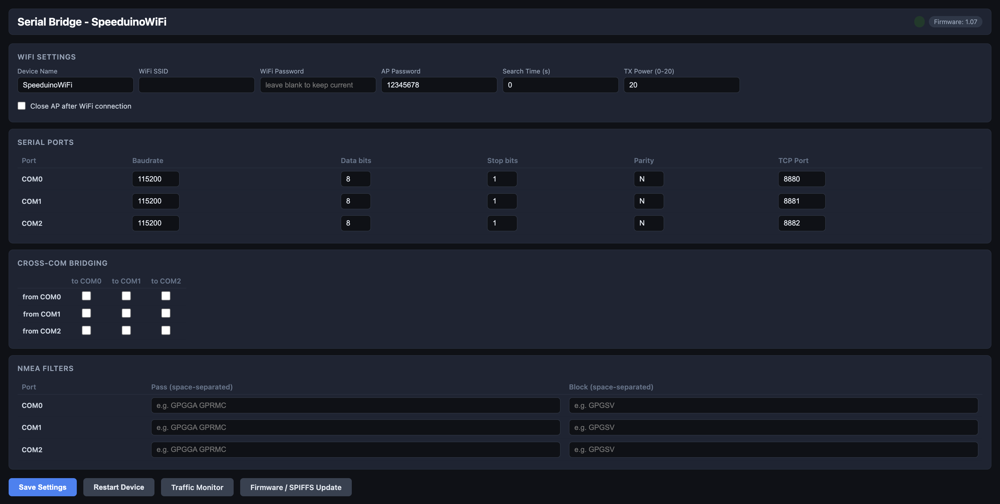
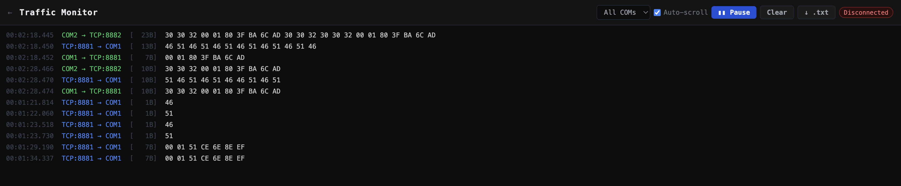
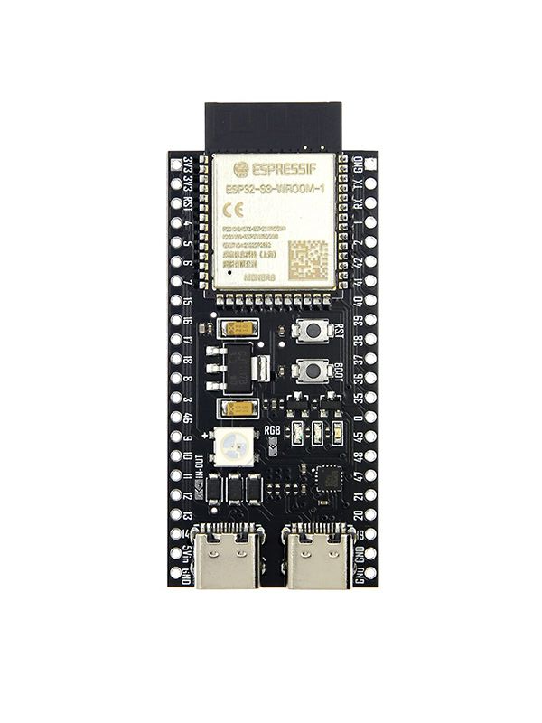

# Speeduino WiFi Serial Bridge

**A WiFi-to-serial bridge for the ESP32-S3 that speaks Megasquirt's native `msEnvelope` protocol — so TunerStudio connects and works out of the box, no special configuration needed.**

Exposes up to three hardware UARTs as TCP sockets. Includes a browser-based configuration UI, live traffic monitor, and over-the-air firmware updates.

---

## Why this bridge?

Most WiFi serial adapters are dumb byte pipes. That works fine for plain serial devices, but Megasquirt and Speeduino ECUs use the `msEnvelope` binary framing protocol. A raw bridge corrupts the framing and TunerStudio fails to connect.

Speeduino WiFi Serial Bridge implements `msEnvelope` natively on the ECU side, reassembling and CRC32-validating frames before forwarding them over TCP — exactly what TunerStudio expects.

| Feature | Generic serial bridge | Speeduino WiFi Serial Bridge |
|---|---|---|
| msEnvelope framing (Megasquirt/Speeduino) | ✗ | ✓ |
| CRC32 frame validation | ✗ | ✓ |
| Simultaneous UART ports | 1 | 3 |
| Browser-based config | varies | ✓ — no app install |
| AP + STA dual WiFi mode | rarely | ✓ |
| Live traffic monitor | ✗ | ✓ |
| NMEA sentence filtering | ✗ | ✓ |
| OTA firmware update | ✗ | ✓ |

---

## Use cases

**Megasquirt / Speeduino → TunerStudio over WiFi**
Wire COM1 to your ECU's serial output and point TunerStudio at `<device-ip>:8881`. msEnvelope framing is handled transparently.

**GPS / NMEA bridging**
Filter GPS sentences per port with pass-lists and block-lists (e.g. pass only `GGA RMC`, block `GSV`). Useful for flight computers and variometers like LK8000.

**Multi-device setup**
ECU on COM1, GPS on COM0, aux device on COM2 — all bridged over WiFi simultaneously on separate TCP ports.

**Cross-port fan-out**
Route one serial input to multiple UARTs or TCP clients without a TCP intermediary.

---

## Quick start

1. Flash firmware: `pio run -t upload`
2. Flash web UI: `pio run -t uploadfs`
3. Connect to WiFi AP — SSID `SpeeduinoWiFi`, password `12345678`
4. Open `http://192.168.4.1` in any browser
5. Point TunerStudio at `192.168.4.1:8881`

> To join your home network, fill in **WiFi Station** in the web UI and press **Save → Restart**. The AP stays active as a fallback.

See [Building & Flashing](docs/flashing.md) for full PlatformIO and OTA instructions.

---

## Web UI



Configure WiFi, serial ports (baud, data bits, stop bits, parity, TCP port), cross-COM routing, and NMEA filters — all from the browser.

---

## Traffic Monitor



Real-time bidirectional hex dump over WebSocket. Filter by port, pause/resume, download as `.txt`.

---

## Features

- **3 × hardware UART** bridged to TCP (default ports 8880 / 8881 / 8882)
- **msEnvelope framing** — CRC32-validated, Megasquirt/Speeduino compatible
- **Up to 4 simultaneous TCP clients** per port
- **Cross-port routing** — configurable fan-out between UARTs
- **NMEA sentence filtering** — pass-list and block-list per port
- **Web UI** — dark-themed single-page app, zero install
- **Live traffic monitor** — real-time hex dump via WebSocket
- **OTA firmware update** — browser drag-and-drop via ElegantOTA
- **AP + STA dual WiFi mode** — AP stays active while joined to a router
- **NeoPixel status LED** — blue for ECU→TCP, red for TCP→ECU, cyan for both
- **NVS persistence** — all settings survive power cycles
- **Dual-core design** — serial bridge on core 1, network stack on core 0

---

## Hardware

### Recommended board



**ESP32-S3-DevKitC-1** (8 MB flash, no PSRAM) — the only tested board.

### UART pin assignments

| Port | TCP port | RX GPIO | TX GPIO |
|------|----------|---------|---------|
| COM0 | 8880 | 21 | 1 |
| COM1 | 8881 | 15 | 17 |
| COM2 | 8882 | 15 | 4 |

> COM1 and COM2 share RX pin GPIO 15. Use only one at a time for input, or add an external multiplexer.

### Wiring


GPIO pins are **3.3 V only — not 5 V tolerant**. Use a 3.3 V TTL USB-to-serial adapter (PL2303, CP2102) or a MAX3232 level shifter for RS-232. Connect the serial device's TX to the COM port's RX GPIO, and its RX to the TX GPIO.

---

## Desktop tools

**`tools/proxy.py`** — transparent proxy that creates a virtual serial port so TunerStudio can connect while all traffic is logged to stdout and a `.txt` file. Works in TCP mode (bridge over WiFi) and Serial USB mode (direct ECU). Essential for debugging communication issues.

```bash
# TCP mode — intercept traffic between TunerStudio and the bridge
python tools/proxy.py 192.168.4.1 8881 --log session.txt

# Serial USB mode — intercept a direct USB-to-serial connection
python tools/proxy.py /dev/cu.usbserial-1410 --baud 115200
```

**`tools/monitor.py`** — simple interactive TCP console for quick manual testing of a port.

```bash
python tools/monitor.py 192.168.4.1 8880
```

See [Desktop tools](docs/tools.md) for full usage.

---

## Further reading

- [msEnvelope protocol & LED indicators](docs/protocol.md)
- [Building, flashing & OTA updates](docs/flashing.md)
- [Desktop tools (proxy.py, monitor.py)](docs/tools.md)
- [Troubleshooting](docs/troubleshooting.md)

---

## License

See `LICENSE` file. Use at your own risk.
